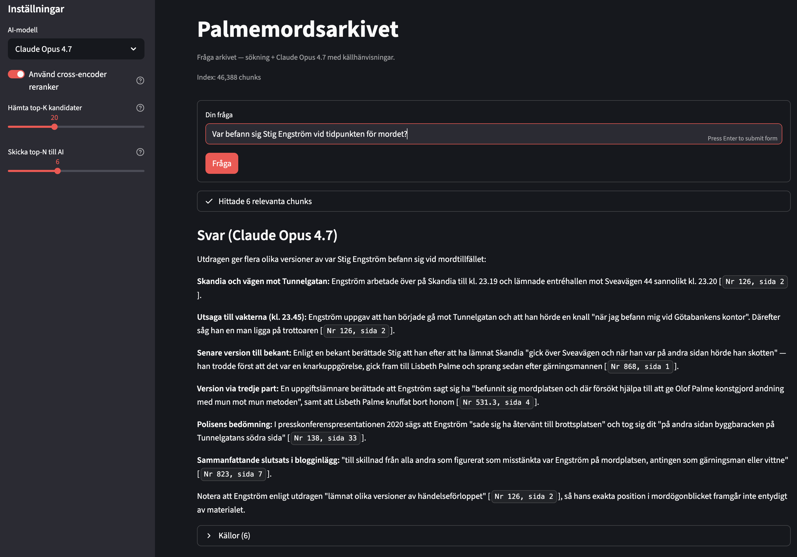

# palmemordsarkivet

Skript för att ladda ner, OCR-tolka och söka i materialet på
[palmemordsarkivet.se](https://palmemordsarkivet.se) — ett publikt Google Sheet
med drygt 3 700 PDF-filer (~33 000 sidor) som länkas via "Länk till kopia".

Efter nedladdning, ocr-scanning så finns det ett web-gränssnitt som man kan ställa frågor om Palme-mordet i.



## Krav

- macOS (testat på Darwin 25), Python 3.11+
- Homebrew för OCR-verktygen och `claude` CLI
- Claude Pro/Max-abonnemang (OAuth-token) eller Anthropic API-nyckel för `rag/ask.py`

## Installation

```bash
git clone git@github.com:paddan/palmemordsarkivet.git
cd palmemordsarkivet

python3 -m venv .venv
.venv/bin/pip install --upgrade pip
.venv/bin/pip install gdown requests sentence-transformers lancedb pyarrow claude-agent-sdk streamlit

brew install ocrmypdf tesseract-lang poppler unpaper claude-code
```

Valfritt för Surya-OCR (alternativ till Tesseract, högre kvalitet på degraderade scans):

```bash
.venv/bin/pip install surya-ocr 'transformers<5'
```

Surya 0.17 fungerar inte med transformers 5.x — pinnen är medvetet vald.

## Användning

### 1. Ladda ner PDF-filerna

```bash
.venv/bin/python download.py files
```

- Hämtar Google Sheet som CSV, plockar ut Drive-ID från "Länk till kopia".
- Filnamn blir `<Nr> — <Titel> — <Beställt> — <Upplagt> — <Anmärkning> — <Sidor>.pdf`.
- Korrekt extension via magic-bytes (PDF/JPG/PNG/...).
- Idempotent: hoppa över redan nedladdade. Visar progress + ETA.

För hela arkivet (tar några timmar), kör i bakgrunden:

```bash
nohup .venv/bin/python download.py files > log.txt 2>&1 &
```

### 2. OCR till text

Förbered tessdata (engångsåtgärd — laddar ner swe_best, mer noggrann modell):

```bash
./setup_tessdata.sh
```

Sen:

```bash
./ocr.sh
```

- Snabbkoll först: om PDF:en redan har textlager extraheras det direkt utan OCR.
- Annars `ocrmypdf -l swe+eng --rotate-pages --deskew --clean` med PSM 6
  (förhörsprotokoll-vänlig page-segmentation), `swe_best.traineddata` från
  `tessdata/`, och `tessdata/swe.user-words` (Palme-specifika namn, Q/A-markörer,
  ärendenummer-prefix).
- Parallelliserar över filer med `xargs -P` (default 4 jobb).
- Idempotent.

Tunables via env: `JOBS=8 PER_FILE_JOBS=2 PSM=4 ./ocr.sh`.

Lägen:

```bash
./ocr.sh                       # normal: OCR:a sidor utan textlager
REDO_TEXT_LAYER=1 ./ocr.sh     # kör om OCR på alla PDF:er som har textlager
                               # (för PDF:er med inbäddat OCR-skräp)
```

Vid riktiga fel skrivs `[fel] <namn>` följt av indragen ocrmypdf-logg. Tesseracts
varningar för blanka sidor (`Too few characters. Skipping this page` /
`Error during processing`) är benigna och göms numera — filen blir ändå OCR:ad.

#### Alternativ: Surya för värsta filerna

Tesseract klarar ~85 % av materialet bra men kämpar på degraderade scans. För
de filerna ger [Surya](https://github.com/VikParuchuri/surya) (transformer-OCR)
markant högre kvalitet — i stickprov på 50 svåra filer: medelpoäng 60 → 73,
49 av 50 bättre. Priset är fart (~30–100 s/sida på Apple Silicon MPS, mot
~1 s/sida för Tesseract).

Hybrid-workflow:

```bash
./ocr.sh                                                # full Tesseract-omgång
.venv/bin/python quality.py                             # bygg quality.csv
.venv/bin/python ocr_surya.py --in files --out text_surya  # eller bara värsta filerna
```

För att bara ta värsta filerna, symlinka över de PDF:er där `quality.csv`-poäng
< 50 till en separat katalog och kör `ocr_surya.py` mot den.

`ocr_surya.py` skriver bara `.txt`. För att få sökbara PDF:er med Surya-textlager
(motsvarande Tesseracts output i `ocr/`) finns `ocr_surya_pdf.py` som kör Surya

- bäddar in osynligt textöverdrag i en kopia av PDF:en via PyMuPDF:

```bash
.venv/bin/pip install pymupdf
.venv/bin/python ocr_surya_pdf.py --in <indir> --out ocr --text-out text_surya
```

### 3. Indexera i vektor-DB

```bash
.venv/bin/python rag/ingest.py
```

- Chunkar `text/*.txt` (800 tecken med 150 teckens överlapp, bryter på radslut).
- Embeddar lokalt med `intfloat/multilingual-e5-large` (svenska duger bra).
- Lagrar i lokal LanceDB med metadata (Nr, Titel, Sida, Anmärkning).
- Filtrerar bort OCR-skräp (chunks med <55 % alfanumeriska tecken).
- Idempotent. Första körningen laddar ned ~1.1 GB modell.

### 4. Ställ frågor

```bash
# Pro/Max-abonnemang (räknas mot abonnemangets timgränser):
export CLAUDE_CODE_OAUTH_TOKEN=sk-ant-oat01-...
# Eller API-credits:
# export ANTHROPIC_API_KEY=sk-ant-...

.venv/bin/python rag/ask.py "Vad sa Annett Kohut om kvällen 28 februari?"
.venv/bin/python rag/ask.py --rerank "..."   # bättre precision (laddar ned 568 MB modell)
.venv/bin/python rag/ask.py                  # interaktiv repl

# Eller via wrapper-skriptet (aktiverar venv, läser in token, --rerank som default):
./ask.sh "Vem är Stig Engström?"
./ask.sh --no-rerank "snabbare"

# Webgränssnitt (Streamlit) — aktiverar venv, läser token, öppnar i webbläsaren:
./web.sh
```

Webgränssnittet stödjer flera AI-backends via en väljare i sidebaren:

- **Claude Opus 4.7** (default) — via `claude-agent-sdk` med adaptive thinking,
  kräver `CLAUDE_CODE_OAUTH_TOKEN` eller `ANTHROPIC_API_KEY`.
- **OpenAI GPT-5 / GPT-4o** — kräver `OPENAI_API_KEY`.
- **DeepSeek V4 / Reasoner** — kräver `DEEPSEEK_API_KEY`
  (`deepseek-chat` är V4-routern, `deepseek-reasoner` är thinking-modellen).
- **OpenAI-kompatibel (custom)** — pekar på vilken `/v1`-endpoint som helst
  (Ollama, LM Studio, llama.cpp, vLLM, fjärr-OpenAI-providers...). URL,
  modellnamn och valfri API-nyckel konfigureras i sidebaren.

Lägg till `openai` om du vill använda andra backends än Claude:

```bash
.venv/bin/pip install openai
```

För lokal Ollama:

```bash
brew install ollama
ollama serve &
ollama pull llama3.1:8b
```

Citat i svaret renderas som små inline-knappar — klick öppnar original-PDF:en
lokalt (via `open`) i en gömd iframe så huvudsidan inte laddas om.

Hämtar top-20 chunks från vektor-DB, ev. omrankar med `BAAI/bge-reranker-v2-m3`,
skickar topp-6 till Claude Opus 4.7 (adaptive thinking) via Claude Agent SDK.
Svarar på svenska med källhänvisningar `[Nr X, sida Y]`. Säger
"framgår inte av materialet" hellre än att gissa.

OAuth-token genereras med `claude setup-token` (engångsåtgärd).

## Filer

| Fil | Vad |
|---|---|
| `download.py` | Hämta PDF:er från Drive |
| `setup_tessdata.sh` | Sätt upp projekt-lokal `tessdata/` med swe_best |
| `ocr.sh` | Tesseract-OCR + textextraktion |
| `ocr_surya.py` | Surya-OCR till `.txt` (alternativ, högre kvalitet på svåra scans) |
| `ocr_surya_pdf.py` | Surya-OCR + inbäddat osynligt textlager i sökbar PDF |
| `quality.py` | Heuristisk kvalitetsbedömning av `text/*.txt` |
| `redo_ocr.sh` | Kör om OCR med `--redo-ocr` på filer med dåligt textlager |
| `rag/ingest.py` | Bygg vektorindex |
| `rag/ask.py` | Frågefronten |
| `ask.sh` | Wrapper för `rag/ask.py` (aktiverar venv, läser token) |
| `webui.py` | Streamlit-webgränssnitt för frågor |
| `web.sh` | Wrapper för Streamlit-servern |
| `tessdata/swe.user-words` | Palme-specifika ord (committat) |
| `tessdata/tesseract.config` | `preserve_interword_spaces 1` (committat) |

### Bonus: kvalitetskoll

```bash
.venv/bin/python quality.py --top 30
```

Skriver `quality.csv` (sorterat värst först) med poäng 0–100 per fil baserat på
junk-tecken-andel, andel 1–2-tecken-ord, ihopklistrade ord, siffror inuti ord
och vokal/konsonant-balans. Markerar källa `text-layer` (originalet hade text)
vs `ocr` (Tesseract).

Viktig insikt: `text-layer` betyder inte automatiskt "bra" — vissa PDF:er har
gammalt OCR-skräp inbäddat fastän originalbilden är fullt läsbar. Sortera
efter `score`, inte efter källa. För dessa: kör `./redo_ocr.sh` som anropar
`ocrmypdf --redo-ocr` (tar bort det dåliga textlagret och OCR:ar om från
bilden). Tröskel via env: `THRESHOLD=70 ./redo_ocr.sh`. Inkludera även
dåliga Tesseract-filer: `SOURCE=any ./redo_ocr.sh`.

Valfritt: installera hunspell + svensk ordlista så fylls `pct_swe`-kolumnen i:

```bash
brew install hunspell
mkdir -p ~/Library/Spelling
curl -L -o ~/Library/Spelling/sv_SE.aff \
  https://raw.githubusercontent.com/LibreOffice/dictionaries/master/sv_SE/sv_SE.aff
curl -L -o ~/Library/Spelling/sv_SE.dic \
  https://raw.githubusercontent.com/LibreOffice/dictionaries/master/sv_SE/sv_SE.dic
echo "katt hus blabla" | hunspell -d sv_SE -l   # ska skriva ut "blabla"
```

## Datafiler (gitignorerade)

`files/`, `ocr/`, `text/`, `text_surya/`, `rag/lancedb/`, `tessdata/*.traineddata`
— åter-skapas helt av skripten (`text_surya/` av `ocr_surya.py`,
`tessdata/swe.traineddata` av `setup_tessdata.sh`).

## Starta om

Alla fyra steg är idempotenta — kör om utan oro. De hoppar över redan färdigt
arbete (download: `files/<namn>.pdf` finns; ocr: `text/<namn>.txt` finns;
ingest: `source` redan i tabellen). Avbrutna körningar fortsätter där de slutade.

## Licens

Skripten är personliga arbetsverktyg, ingen explicit licens. Materialet i
arkivet ägs av sina respektive upphovsmän.
