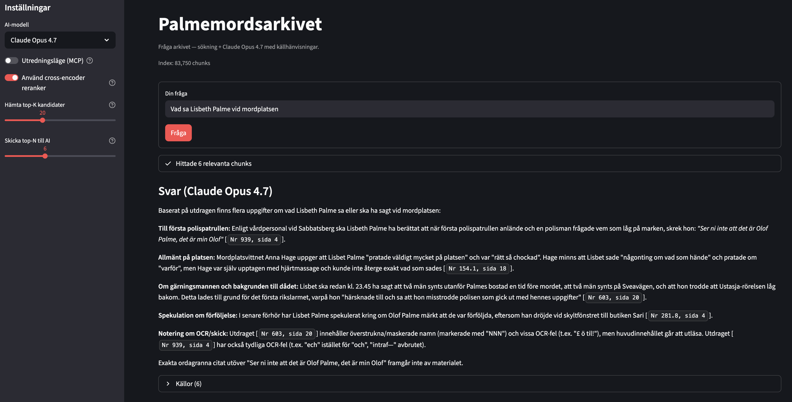

# palmemordsarkivet

[](LICENSE)

Skript för att ladda ner, OCR-tolka och söka i materialet på
[palmemordsarkivet.se](https://palmemordsarkivet.se) — ett publikt Google Sheet
med drygt 3 700 PDF-filer (~33 000 sidor) som länkas via "Länk till kopia".

Efter nedladdning, ocr-scanning så finns det ett web-gränssnitt som man kan ställa frågor om Palme-mordet i.

Webgränssnittet har två söklägen:

**RAG (standard)** — *retrieval-augmented generation*. En fast pipeline: frågan
embedas och matchas mot vektorindexet, de bästa utdragen rerankas, och de
6 mest relevanta skickas som kontext till Claude som formulerar svaret med
källhänvisningar. Snabbt och förutsägbart — passar enkla faktafrågor där ett
söksteg räcker.



**MCP (utredningsläge)** — Claude söker *autonomt* via
[Model Context Protocol](https://modelcontextprotocol.io). Istället för en
fast pipeline får Claude tillgång till verktyg (`search_archive`, `get_page`)
som den anropar hur många gånger den vill — provar olika söktermer, följer
upp intressanta träffar och läser hela sidor för mer kontext. Bättre täckning
på komplexa flerstegs-frågor, men långsammare (~1–3 min).


## Kom igång

```bash
./install.sh           # installera alla beroenden (brew, Python-paket, tessdata)
```

Sätt sedan en API-nyckel:

```bash
export CLAUDE_CODE_OAUTH_TOKEN=sk-ant-oat01-...   # Pro/Max-abonnemang (rekommenderas)
# eller:
export ANTHROPIC_API_KEY=sk-ant-...               # API-credits
```

Kör sedan pipeline:

```bash
./download.sh          # 1. Ladda ner alla PDF:er (~3 700 st, tar några timmar)
./ocr.sh               # 2. OCR → text (Tesseract + Surya på svåra sidor, tar flera timmar)
./ingest.sh            # 3. Bygg vektorindex i LanceDB
./web.sh               # 4. Starta webgränssnittet och ställ frågor
```

Varje steg är idempotent — avbryt och fortsätt när som helst.

## Krav

- macOS (testat på Darwin 25), Python 3.11+
- [Homebrew](https://brew.sh)
- Claude Pro/Max-abonnemang (OAuth-token) eller Anthropic API-nyckel

## Vad install.sh gör

`install.sh` sköter allt via Homebrew och pip:

- `ocrmypdf`, `tesseract-lang`, `poppler`, `unpaper`, `hunspell` via brew
- sv_SE-ordlista länkad till `~/Library/Spelling/` (för qualitets-scoring)
- `.venv/` med `pip install -e .[webui]`
- Laddar ner `swe_best.traineddata` (~12 MB) via `setup_tessdata.sh`

Surya-OCR ingår som standard. Hoppa över det (snabbare install) med:

```bash
./install.sh --no-surya
```

> **Beroendepinnar:** `sentence-transformers<5` och `transformers<5` är medvetet pinnade — 5.x-versionerna bryter cross-encoder-laddning och Surya-integrationen.

## Användning

### 1. Ladda ner PDF-filerna

```bash
./download.sh
./download.sh --out files --help
```

- Hämtar Google Sheet som CSV, plockar ut Drive-ID från "Länk till kopia".
- Filnamn blir `<Nr> — <Titel> — <Beställt> — <Upplagt> — <Anmärkning> — <Sidor>.pdf`.
- Korrekt extension via magic-bytes (PDF/JPG/PNG/...).
- Idempotent: hoppa över redan nedladdade. Visar progress + ETA.

För hela arkivet (tar några timmar), kör i bakgrunden:

```bash
nohup ./download.sh > log.txt 2>&1 &
```

#### Komplettera med wpu.nu

[wpu.nu](https://wpu.nu/wiki/Dokument) publicerar en del av samma material men ibland med bättre skanningar. Ladda ner hela wpu-samlingen till en separat katalog:

```bash
./download_wpu.sh          # ladda ner alla PDF:er → files_wpu/
./download_wpu.sh --dry-run  # lista utan att ladda ner
```

`ocr.sh` kör automatiskt `merge_wpu.sh` direkt efter Tesseract-steget om `files_wpu/` finns, så att wpu-text också kan få Surya-behandling om kvaliteten är låg. Skriptet jämför textkvaliteten (0–100-poäng) per fil och väljer det bästa alternativet:

| wpu-text      | Match i palme? | Utfall                      |
| ------------- | -------------- | --------------------------- |
| OK (≥ 30 p)   | Ja             | Bäst vinner (margin 5 p)    |
| Dålig (< 30 p)| Ja             | Behåll palme-texten         |
| OK            | Nej            | Skriv som ny fil i `text/`  |
| Dålig         | Nej            | OCR-skanna wpu-filen        |

```bash
./merge_wpu.sh             # kör om manuellt (parallellt, default cpu_count)
./merge_wpu.sh --dry-run   # visa vad som skulle hända
./merge_wpu.sh --rebuild   # ignorera .done-markeringar
./merge_wpu.sh --jobs 8    # antal parallella processer
```

### 2. OCR till text

#### Rekommenderad workflow: `ocr.sh`

Kör hela OCR-pipelinen i ett enda kommando — Tesseract på allt, kvalitets-
bedömning, Surya på sidor som inte når tröskeln, och slutbedömning:

```bash
./ocr.sh                         # full pipeline (rekommenderas)
./ocr.sh --threshold 60          # mer aggressiv om-OCR
./ocr.sh --skip-redo             # bara Tesseract + bedömning, ingen Surya
./ocr.sh --help
```

Surya-steget hoppas automatiskt över om paketet inte är installerat. Skriptet
är idempotent — kan avbrytas och köras om utan dubbelarbete.

#### Manuell kontroll

Vill du köra stegen individuellt (för felsökning eller delkörningar) anropar
du delarna direkt:

```bash
./ocr_tesseract.sh               # Tesseract på alla nya filer
./quality.sh --per-page          # bygg quality.csv + quality_pages.jsonl
./ocr.sh --redo --mode pages     # Surya på sidor under tröskeln
./quality.sh                     # uppdaterad bedömning
```

`ocr_tesseract.sh`:s interna logik:
- Snabbkoll först: om PDF:en redan har användbart textlager extraheras det
  direkt utan OCR (kvalitetscheck: alnum-andel, andel korta ord, siffer-i-ord).
- Skräpigt textlager → `ocrmypdf --redo-ocr` (tar bort det och OCR:ar om).
- Inget textlager → `ocrmypdf --skip-text --deskew --clean --rotate-pages` med
  PSM 6, `swe_best.traineddata`, och `tessdata/swe.user-words` (Palme-specifika
  namn, Q/A-markörer, ärendenummer-prefix).
- Parallelliserar över filer med `xargs -P` (default 4 jobb). Idempotent.

Tunables via flaggor (env-vars fungerar fortfarande som fallback):

```bash
./ocr_tesseract.sh --jobs 8 --per-file-jobs 2 --psm 4
./ocr_tesseract.sh --help                          # alla flaggor
JOBS=8 PER_FILE_JOBS=2 PSM=4 ./ocr_tesseract.sh    # bakåtkompatibelt
```

`ocr_tesseract.sh` byter aldrig OCR-engine på egen hand — för Surya på
dåliga sidor använder du `./ocr.sh` ovan eller `./ocr.sh --redo` manuellt.

Vid riktiga fel skrivs `[fel] <namn>` följt av indragen ocrmypdf-logg. Tesseracts
varningar för blanka sidor (`Too few characters. Skipping this page` /
`Error during processing`) är benigna och göms numera — filen blir ändå OCR:ad.

#### Surya för värsta sidorna

Tesseract klarar ~85 % av materialet bra men kämpar på degraderade scans. För
de sidorna ger [Surya](https://github.com/VikParuchuri/surya) (transformer-OCR)
markant högre kvalitet — i stickprov på 50 svåra filer: medelpoäng 60 → 73,
49 av 50 bättre. Priset är fart (~30–100 s/sida på Apple Silicon MPS, mot
~1 s/sida för Tesseract).

Surya körs per sida via `./ocr.sh --redo --mode pages` (default i full pipeline).
Endast sidor med score < threshold OCR:as om, resultatet mergas tillbaka in i
`text/<stem>.txt` per dokument. Se `Per-sida OCR` nedan.

#### Per-sida OCR (`ocr_pages.sh`)

För ännu finare granularitet — om bara enstaka sidor i en fil är dåliga.
Renderar PDF:en sida för sida, OCR:ar varje sida individuellt och skriver
``page-NNN.txt`` + ``page-NNN.json`` (text + score) i en undermapp. Slutsamlar
till ``<stem>.txt`` med ``\f`` som sidbrytare.

```bash
./ocr_pages.sh --in files/foo.pdf --out-dir text_pages --engine tesseract
./ocr_pages.sh --in files/foo.pdf --out-dir text_pages --engine surya
./ocr_pages.sh --in files/foo.pdf --out-dir text_pages --pages 3,7,12
```

Kombo med `./quality.sh --per-page` + `./ocr.sh --redo --mode pages` kör om
bara de sidor som ligger under tröskeln (med Surya som default). Alla skript
har `--help` som listar tillgängliga flaggor; env-vars fungerar fortfarande
som fallback.

#### Auto-byggda user-words (`build_user_words.sh`)

Bygg `tessdata/swe.user-words.auto` från befintliga `text/*.txt`. Filtrerar
mot hunspell sv_SE om installerat, annars freq ≥ 30. Plockas upp automatiskt
av `ocr_tesseract.sh`:

```bash
./build_user_words.sh
```

### 3. Indexera i vektor-DB

```bash
./ingest.sh                       # nya + ändrade filer (mtime-detektering)
./ingest.sh --rebuild             # börja om från noll
./ingest.sh --reindex-since 2026-05-01  # tvinga om för gamla filer modifierade efter datum
./ingest.sh --help                # alla flaggor
```

**Per-sida-merge av Surya-omkörningar:** `ocr.sh --redo --mode pages` skriver
per-sida-text till `text_pages/<stem>/page-NNN.txt`. Direkt efter att ett
dokument är klart slår `ocr.sh` automatiskt ihop dessa sidor in i
`text/<stem>.txt` (en sida i taget, behåller övriga sidor) och raderar
`page-NNN.txt` + `page-NNN.png`. Kvar i `text_pages/<stem>/` blir bara
lättviktiga `page-NNN.json` (kvalitetsmetadata) som fungerar som idempotens-
markör för nya körningar av `ocr.sh --redo --mode pages`.

Resultat: ingest fångar ändringarna via mtime, och `text_pages/` ackumulerar
inte stort innehåll.

För befintliga text_pages-mappar (som inte mergades/städades automatiskt)
finns en engångsåtgärd:

```bash
./merge_pages.sh --all            # slå ihop + städa alla text_pages/<stem>/
./merge_pages.sh --stem "1 — PM …"  # bara en specifik fil
```

Båda kommandona är idempotenta — kör om utan oro, de gör bara något om det
finns nya `page-NNN.txt` att slå in.

- Chunkar `text/*.txt` (800 tecken med 150 teckens överlapp, bryter på radslut).
- Embeddar lokalt med `intfloat/multilingual-e5-large` (svenska duger bra).
- Lagrar i lokal LanceDB med metadata (Nr, Titel, Sida, Anmärkning) **och `mtime`**
  så att ändrade `.txt`-filer (t.ex. efter `ocr.sh --redo`) detekteras automatiskt
  och re-indexeras vid nästa körning.
- För filer som indexerades innan mtime-tracking infördes saknas mtime i tabellen
  (lagras som `0.0`). Använd `--reindex-since <tid>` för att tvinga re-index av
  legacy-rader vars `.txt` modifierats efter en känd tidpunkt — t.ex. när du
  precis kört en re-OCR-våg.
- Filtrerar bort OCR-skräp (chunks med <55 % alfanumeriska tecken).
- Idempotent. Första körningen laddar ned ~1.1 GB modell.

### 4. Ställ frågor

```bash
# Pro/Max-abonnemang (räknas mot abonnemangets timgränser):
export CLAUDE_CODE_OAUTH_TOKEN=sk-ant-oat01-...
# Eller API-credits:
# export ANTHROPIC_API_KEY=sk-ant-...

# Wrapper aktiverar venv, läser token, --rerank som default:
./ask.sh "Vem är Stig Engström?"
./ask.sh --no-rerank "snabbare"
./ask.sh --hybrid "..."           # vector + BM25 sammanslaget med RRF
./ask.sh --mcp "..."              # utredningsläge — Claude söker autonomt
./ask.sh                          # interaktiv repl
./ask.sh --help                   # alla flaggor

# Webgränssnitt (Streamlit) — aktiverar venv, läser token, öppnar i webbläsaren:
./web.sh
```

OAuth-token genereras med `claude setup-token` (engångsåtgärd).

#### RAG-läge (standard)

Klassisk *retrieval-augmented generation*: en fast pipeline i tre steg.

1. **Vektorsökning** — frågan embedas lokalt med `intfloat/multilingual-e5-large`
   och matchas mot LanceDB-indexet (top-20 kandidater).
2. **Hybrid + reranking (valfritt)** — `--hybrid` kombinerar vektor och BM25 (FTS)
   med *Reciprocal Rank Fusion* (k=60). Sedan omrankar
   `BAAI/bge-reranker-v2-m3` resultaten och plockar ut topp-6.
3. **Claude svarar** — de 6 utdragen skickas som kontext till Claude Opus 4.7
   (adaptive thinking). Svaret innehåller källhänvisningar `[Nr X, sida Y]`.

Snabbt och förutsägbart. Passar enkla faktafrågor där ett enstaka söksteg räcker.

#### MCP-läge (`--mcp`)

I utredningsläget söker Claude *autonomt* via
[Model Context Protocol](https://modelcontextprotocol.io). Istället för en fast
pipeline startar systemet en MCP-server (`src/rag/mcp_server.py`) som subprocess
och låter Claude anropa dessa verktyg hur många gånger det vill:

| Verktyg | Vad |
|---|---|
| `search_archive` | Vektor- eller hybridsökning med valfri reranking; returnerar utdrag med källinfo |
| `get_page` | Läser råtexten från en specifik sida för att få mer kontext kring en träff |

Claude väljer själv söktermer, kan söka flera gånger med olika fraser, och kan
följa upp intressanta träffar med `get_page`. Det ger markant bättre täckning på
komplexa flerstegs-frågor — till priset av längre svarstid (upp till 10 anrop,
~1–3 min beroende på fråga).

```text
Enkla faktafrågor  → RAG-läge (snabbt, deterministiskt)
Komplexa utredningsfrågor  → MCP-läge (--mcp, autonomt, bättre täckning)
```

Webgränssnittet (Claude-backend) har en "Utredningsläge (MCP)"-toggle i sidebaren.
I MCP-läget får du en chatt där Claude minns tidigare frågor i konversationen
(implementerat via Claude Agent SDK:s `resume`-fält — `session_id` från senaste
svaret skickas med nästa fråga). Sidebar-knappen "Ny konversation" nollställer
historiken och startar en ny session.

#### Webgränssnittet

Stödjer flera AI-backends via en väljare i sidebaren:

- **Claude Opus 4.7** (default) — via `claude-agent-sdk` med adaptive thinking,
  kräver `CLAUDE_CODE_OAUTH_TOKEN` eller `ANTHROPIC_API_KEY`. Stödjer MCP-läge.
- **OpenAI GPT-5 / GPT-4o** — kräver `OPENAI_API_KEY`.
- **DeepSeek V4 / Reasoner** — kräver `DEEPSEEK_API_KEY`
  (`deepseek-chat` är V4-routern, `deepseek-reasoner` är thinking-modellen).
- **OpenAI-kompatibel (custom)** — pekar på vilken `/v1`-endpoint som helst
  (Ollama, LM Studio, llama.cpp, vLLM, fjärr-OpenAI-providers...). URL,
  modellnamn och valfri API-nyckel konfigureras i sidebaren.

Lägg till `openai` om du vill använda andra backends än Claude:

```bash
.venv/bin/pip install openai
```

För lokal Ollama:

```bash
brew install ollama
ollama serve &
ollama pull llama3.1:8b
```

Citat i svaret renderas som små inline-knappar — klick öppnar original-PDF:en
lokalt (via `open`) i en gömd iframe så huvudsidan inte laddas om.

## Filer

| Fil | Vad |
|---|---|
| `download.sh` → `src/download.py` | Hämta PDF:er från Drive |
| `download_wpu.sh` → `src/download_wpu.py` | Ladda ner alla PDF:er från wpu.nu → `files_wpu/` |
| `merge_wpu.sh` → `src/merge_wpu.py` | Jämför wpu- och palme-text per fil, behåll bäst kvalitet |
| `setup_tessdata.sh` | Sätt upp projekt-lokal `tessdata/` med swe_best |
| `ocr.sh` | Full OCR-pipeline (Tesseract → kvalitet → Surya på dåliga sidor); `--redo` kör om dåliga filer/sidor |
| `ocr_tesseract.sh` | Bara Tesseract-steget (textextraktion + ocrmypdf) |
| `ocr_pages.sh` → `src/ocr_pages.py` | Per-sida OCR (Tesseract/Surya) med sidor i `\f`-separerad txt |
| `merge_pages.sh` → `src/merge_pages.py` | Slå ihop `text_pages/<stem>/page-*.txt` in i `text/<stem>.txt` |
| `build_user_words.sh` → `src/build_user_words.py` | Bygg `tessdata/swe.user-words.auto` från `text/*.txt` |
| `quality.sh` → `src/quality.py` | Heuristisk kvalitetsbedömning av `text/*.txt` (`--per-page` finns) |
| `ingest.sh` → `src/rag/ingest.py` | Bygg vektorindex (LanceDB + BM25 FTS) |
| `ask.sh` → `src/rag/ask.py` | Frågefronten — RAG-läge och `--mcp`-läge |
| `src/rag/mcp_server.py` | MCP-server med `search_archive` och `get_page` (startas av ask.py/webui.py) |
| `src/webui.py` | Streamlit-webgränssnitt för frågor (RAG + MCP-toggle) |
| `web.sh` | Wrapper för Streamlit-servern |
| `tessdata/swe.user-words` | Palme-specifika ord (committat) |
| `tessdata/tesseract.config` | `preserve_interword_spaces 1` (committat) |

### Bonus: kvalitetskoll

```bash
./quality.sh --top 30
```

Skriver `quality.csv` (sorterat värst först) med poäng 0–100 per fil baserat på
junk-tecken-andel, andel 1–2-tecken-ord, ihopklistrade ord, siffror inuti ord
och vokal/konsonant-balans. Markerar källa `text-layer` (originalet hade text)
vs `ocr` (Tesseract).

Viktig insikt: `text-layer` betyder inte automatiskt "bra" — vissa PDF:er har
gammalt OCR-skräp inbäddat fastän originalbilden är fullt läsbar. Sortera
efter `score`, inte efter källa. För dessa: kör `./ocr.sh --redo --mode files`
som anropar `ocrmypdf --redo-ocr` (tar bort det dåliga textlagret och OCR:ar
om från bilden). Default tar med både `text-layer`- och `ocr`-källor. Tröskel
via flagga: `./ocr.sh --redo --mode files --threshold 70` (eller env
`THRESHOLD=70`). Begränsa till en källa: `./ocr.sh --redo --mode files
--source text-layer`. `./ocr.sh --help` listar alla flaggor.

Valfritt: installera hunspell + svensk ordlista så fylls `pct_swe`-kolumnen i:

```bash
brew install hunspell
mkdir -p ~/Library/Spelling
curl -L -o ~/Library/Spelling/sv_SE.aff \
  https://raw.githubusercontent.com/LibreOffice/dictionaries/master/sv_SE/sv_SE.aff
curl -L -o ~/Library/Spelling/sv_SE.dic \
  https://raw.githubusercontent.com/LibreOffice/dictionaries/master/sv_SE/sv_SE.dic
echo "katt hus blabla" | hunspell -d sv_SE -l   # ska skriva ut "blabla"
```

## Tester

```bash
.venv/bin/pip install pytest
.venv/bin/pytest tests/
```

Testerna täcker `score_text`, `chunk_text`, `extract_drive_id` och
`sniff_extension`. Fixturen som genererar en mini-PDF med pymupdf skipas
gracefully om pymupdf inte är installerat.

## Felloggning

Skript skriver tab-separerade rader till `errors.log` i projekt-roten:
``ISO8601\tcomponent\titem\tmessage``. Python-skript via `errors_log.log_error`,
bash via `>> "$ROOT/errors.log"`. Append-only, idempotent.

## Datafiler (gitignorerade)

`files/`, `files_wpu/`, `ocr/`, `text/`, `text_pages/`, `text_wpu/`, `rag/lancedb/`, `tessdata/*.traineddata`
— åter-skapas helt av skripten (`text_pages/` av `ocr_pages.py`,
`tessdata/swe.traineddata` av `setup_tessdata.sh`).

## Starta om

Alla fyra steg är idempotenta — kör om utan oro. De hoppar över redan färdigt
arbete (download: `files/<namn>.pdf` finns; ocr: `text/<namn>.txt` finns;
ingest: `source` redan i tabellen *och* `.txt`-filens mtime är ≤ den lagrade).
Avbrutna körningar fortsätter där de slutade. När en `.txt` skrivs om av t.ex.
`ocr.sh --redo` upptäcker `ingest.sh` det automatiskt och re-indexerar bara den
filen (delete + add).

## Licens

Skripten är personliga arbetsverktyg, ingen explicit licens. Materialet i
arkivet ägs av sina respektive upphovsmän.
