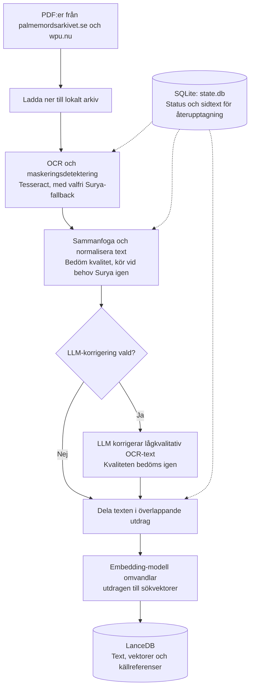
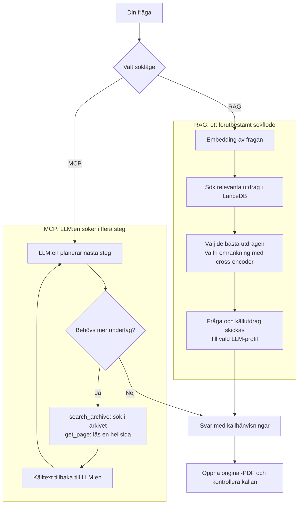

# palmemordsarkivet

Skript för att ladda ner, OCR-tolka och söka i material om Palmemordet från
[palmemordsarkivet.se](https://palmemordsarkivet.se) och
[wpu.nu](https://wpu.nu/wiki/Dokument). Palmemordsarkivet länkar till PDF:er
via ett publikt Google Sheet, medan WPU kompletterar med fler dokument och
ibland bättre skanningar av samma material.

Pipelinen laddar ner arkivet, OCR-tolkar varje sida (Tesseract + Surya-fallback
vid Tesseract-fel och på svåra sidor), indexerar texten i en lokal
vektor-databas och ger dig ett
webgränssnitt där du kan ställa frågor om Palme-mordet — med källhänvisningar
tillbaka till original-PDF:erna. Som komplement kan materialet byggas upp som en
kunskapsgraf och utforskas visuellt.

## Från PDF till sökbart arkiv

Pipelinen förbereder materialet för sökning. Diagrammet visar huvudstegen;
OCR-steget omfattar även sammanslagning av sidtext och hantering av WPU-material.

SQLite håller reda på vad som redan är gjort, så pipelinen kan återupptas och
bara bearbeta det som behövs. LanceDB lagrar det sökbara indexet.
En **embedding** är en numerisk representation av textens betydelse; den
gör att sökningen kan hitta relevanta utdrag även när ordvalet skiljer sig.
LLM-korrigering är valfri och separat från LLM:en som senare besvarar frågor.

## Web-gränssnitt

Efter nedladdning och OCR-scanning finns ett webgränssnitt (`./web.sh`, en
genväg till `.venv/bin/python scripts/web.py`) med
flikar: **Utredning** för frågor (med facett- och OCR-tolerant fuzzy-filter),
**Utredningspärm** för sparade spår, bokmärken och anteckningar, **Graf** för
relationer, **Maskeringar** för att utforska svärtad text och **Jämförelse**
för att ställa källor mot varandra, **Karta** för källhänvisade
observationer på mordkvällen, samt **Admin** för att starta/övervaka/avbryta
produktionsflöden och bakgrundsjobb.

### Utredning

Diagrammet visar de två sätten att besvara en fråga. I RAG-läget hämtar
programmet kontext före LLM-anropet. I MCP-läget styr LLM:en själv vilka
sökningar och sidläsningar som behövs.

Arkivet används som källunderlag vid frågetillfället; modellerna tränas inte
om på dokumenten. Källhänvisningarna låter dig kontrollera LLM:ens tolkning
mot originalmaterialet.

#### RAG (standard)

En fast pipeline: frågan
embedas och matchas mot vektorindexet, de bästa utdragen rerankas, och de
6 mest relevanta skickas som kontext till AI som formulerar svaret med
källhänvisningar. Snabbt och förutsägbart — passar enkla faktafrågor där ett
söksteg räcker.

#### MCP (utredningsläge)

AI söker *autonomt* via
[Model Context Protocol](https://modelcontextprotocol.io). Istället för en
fast pipeline får AI:n tillgång till verktyg (`search_archive`, `get_page`)
som den anropar hur många gånger den vill — provar olika söktermer, följer
upp intressanta träffar och läser hela sidor för mer kontext. Bättre täckning
på komplexa flerstegs-frågor, men långsammare (~1–3 min).
Läget väljs som flik: **Fråga arkivet (RAG)** och **Utredningsläge (MCP)**. I
RAG-fliken ligger sökvalen (reranker, top-K/top-N, facetter och fuzzy-sökning)
i den hopfällbara sektionen *Sökinställningar*; MCP-fliken har i stället chatten
och **Ny konversation**. Sidofältet visar LLM-profilen, kunskapsgrafens toggle
och en räknare över token och ackumulerad kostnad för profilen.

LLM-profiler skapas och redigeras i ett sammanhållet formulär under **Admin →
Inställningar → LLM-inställningar** och väljs i Utredningssidans sidofält. I
samma panel anger du profilnamn, standardstatus, tjänst och modell; endpoint,
miljövariabel och priser (USD per 1M token, för kostnadsräkningen) ligger under
avancerade inställningar. Själva API-nyckeln sparas aldrig.

### Utredningspärm

I fliken **Utredningspärm** visas fråga/svar-spår som sparats från både RAG- och
MCP-läget som kollapsade poster med kort rubrik; öppna en post för att läsa
svaret, källorna, modellvalet, grafentiteterna och eventuell egen anteckning.
Källorna visas som klickbara källkort med PDF/text-knappar, och sparade
grafentiteter har en länk som återskapar grafen i Graf-fliken. Källor i svarens
källista kan också bokmärkas separat så att du snabbt hittar tillbaka till
viktiga PDF:er och sidor. En egen flik samlar dessutom alla **anteckningar** du
skrivit på källor (✏️-rutan på källkorten) — flera anteckningar per källa.

### Maskeringar

Fliken **Maskeringar** listar dokument efter hur mycket text som svärtats över
(`[MASKAD]`). Klicka på en dokumentrad i tabellen för att visa källknappar och
kontextutdrag runt maskeringarna. Det som dolts är ofta lika intressant som
innehållet.

### Jämförelse

Fliken **Jämförelse** är ett korsförhörsläge: ange ett ämne så hämtas flera
källor och AI:n ställer dem mot varandra och lyfter fram var de **säger emot**
varandra — i stället för att jämka ihop uppgifterna som i vanliga svar.
Referenserna i svaret är klickbara och öppnar matchande PDF.
PDF:en öppnas i en ny webbläsarflik; när sidnumret är känt skickas det med så
webbläsarens PDF-visare kan hoppa till rätt sida.

### Karta

**Karta** visar källhänvisade observationer på en tidsanimerad karta över
mordkvällen. Platskatalogen seedas och används för snabbval i formuläret, medan
observationerna kan redigeras i appen; rörelser visas bara när de har tid,
koordinater och källa. Kartförslag kan dessutom extraheras som en separat
granskningskö med `./extract_map_observations.sh` och godkänns manuellt innan
de syns på kartan.

### Graf

En **Graf**-sida visualiserar kunskapsgrafen: sök en person, plats eller
organisation och utforska dess nätverk av relationer och källdokument som ett
interaktivt ego-nätverk — dubbelklicka en nod för att fälla ut dess grannskap
eller öppna ett källdokument. Samma graf kan även visas till ett svar i
frågeläget, centrerad kring de entiteter svaret handlar om — den byggs först när
du öppnar grafsektionen, inte automatiskt efter varje svar. I Graf-sidan kan du
också återkommande hitta tveksamma noder och relationer, granska dem mot
källsidan manuellt eller med LLM-förslag och sedan förhandsvisa, uppdatera och
verifiera Neo4j. Beslut som blivit inaktuella efter en ny extraktion kan
återställas i samma vy innan grafen uppdateras.
I samma vy kan du skapa en global namnregel, till exempel
`RKA2` → `Rikskriminalen A2`, och se dess träffar innan den används över hela
den granskade grafen.

## Dokumentation

- **[Kom igång](docs/kom-igang.md)** — installation, API-nyckel, kör pipelinen
  och ställ din första fråga.
- **[Teknisk referens](docs/teknisk-referens.md)** — alla steg och flaggor i
  detalj: nedladdning, OCR (Tesseract/Surya), indexering, RAG/MCP, state-databasen,
  valfri installation av kunskapsgrafen, LLM-konfiguration, filöversikt och
  tester.

## Licens

Koden är licensierad under [MIT](LICENSE). Materialet i arkivet ägs av sina
respektive upphovsmän och berörs inte av denna licens.
